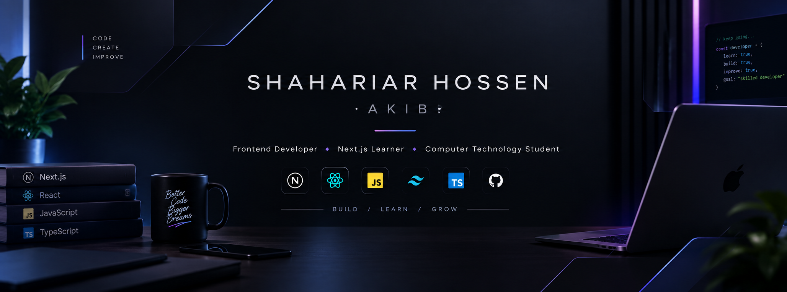

  

# Hi, I'm Shahariar Hossen Akib

### Frontend Developer • Next.js Learner • Computer Technology Student

---

## About Me

I'm a **Computer Technology student** and a passionate **web development learner**.

Currently, I'm focusing on **JavaScript, React, and Next.js**. I enjoy building modern, responsive web applications and learning new technologies through real-world projects.

---

## Currently Learning

* Exploring Next.js and modern React
* Improving my JavaScript and TypeScript skills
* Building projects with React and Next.js
* Learning backend development and authentication
* Practicing problem solving and clean code

---

## Skills & Technologies

  

---

## Connect With Me

  

---

## GitHub Statistics

  

  

---

## Most Used Languages

  

---

## Let's Build Something Amazing

I'm always excited to **learn, build, and explore new technologies**.

  <b>Keep Learning • Keep Building • Keep Growing</b>

